# AWS 2-Tier Application Architecture

## Project Overview

This project demonstrates the setup of **AWS EC2 instances, Application Load Balancer (ALB), Auto Scaling, and CloudWatch monitoring**.  
It includes **VPC, Subnets, Route Tables, Security Groups, SNS notifications**, and **path-based routing using ALB**.

---

## Architecture

Client → Internet Gateway → Load Balancer → Target Groups → EC2 Instances → CloudWatch & Auto Scaling

**Architecture Diagram:**

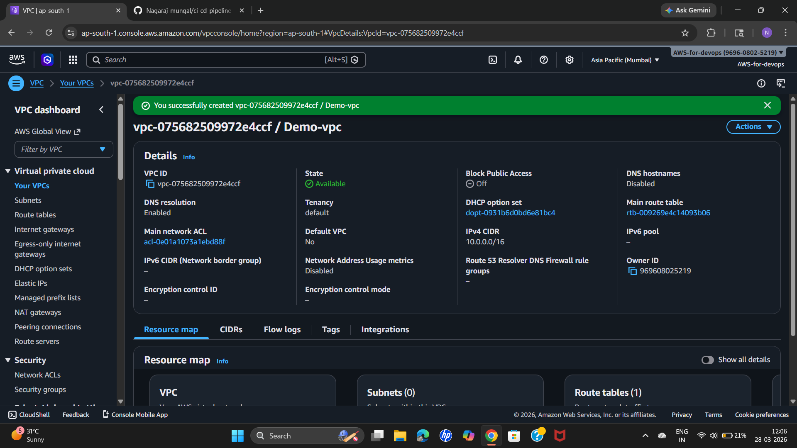  
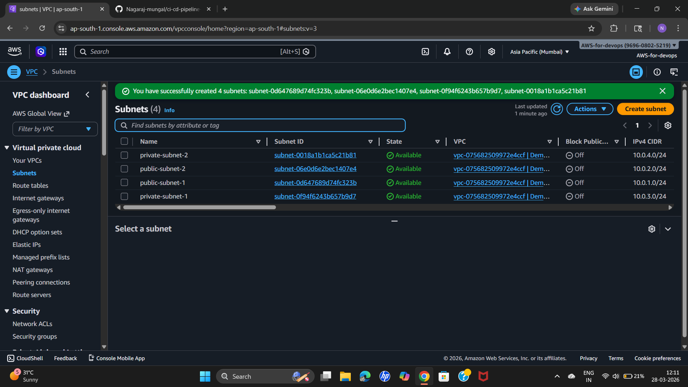  
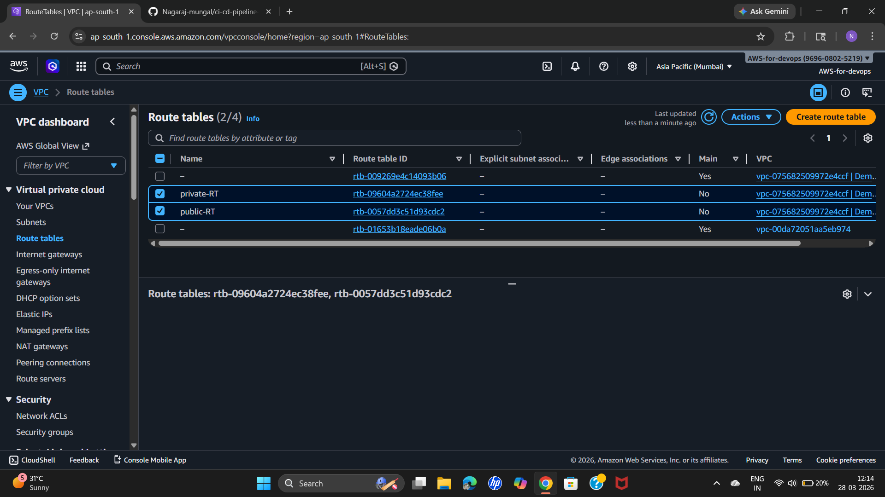  
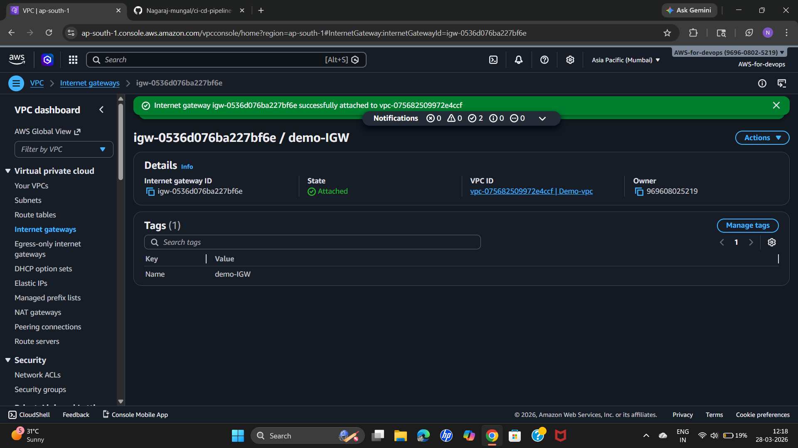  
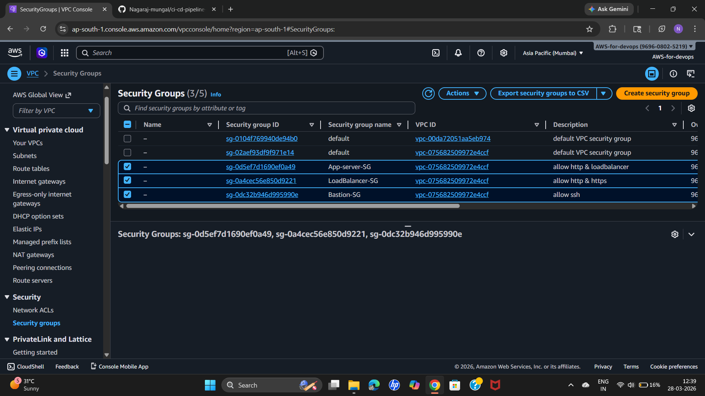  

---

## AWS Services Used

* EC2 Instances
* VPC, Subnets, Route Tables
* Internet Gateway
* Security Groups
* Application Load Balancer (ALB)
* Target Groups
* Auto Scaling Groups
* CloudWatch Alarms
* SNS Topics and Subscriptions
* GitHub
* Apache HTTP Server

---

## Project Workflow & Screenshots

### 1. Launch EC2 Instances

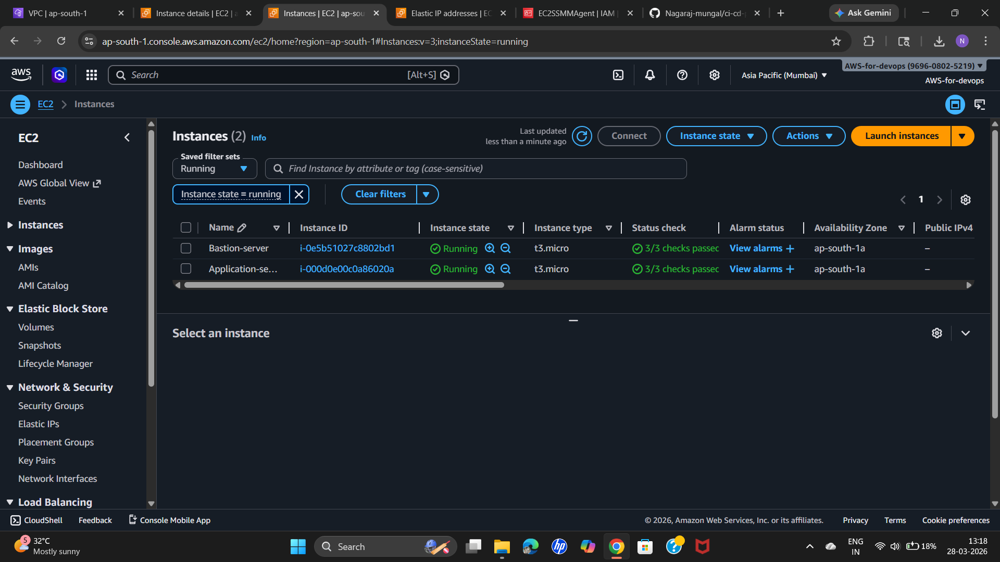

---

### 2. Setup Application Load Balancer

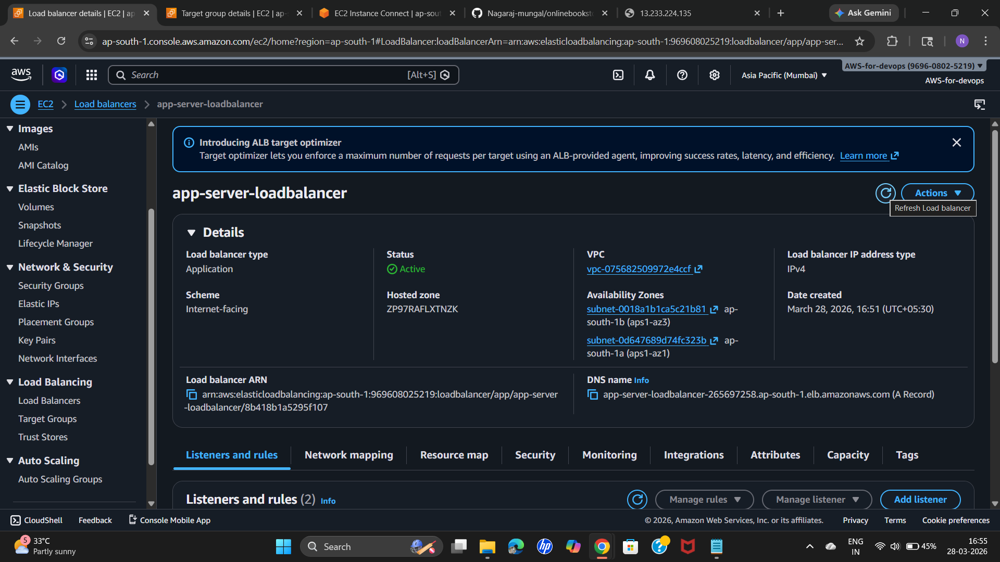  

---

### 3. Configure Target Groups

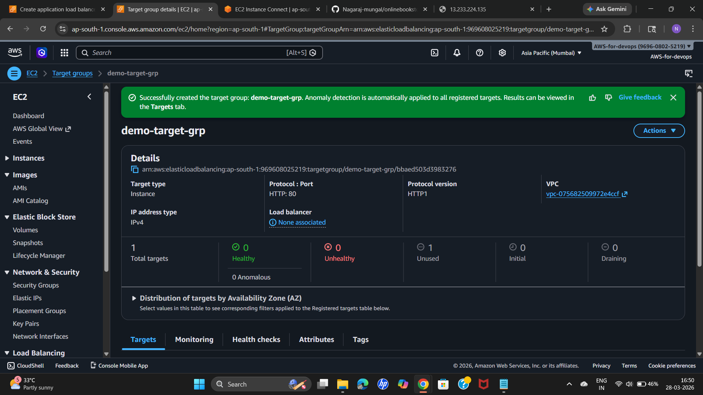

---

### 4. Configure Auto Scaling Group

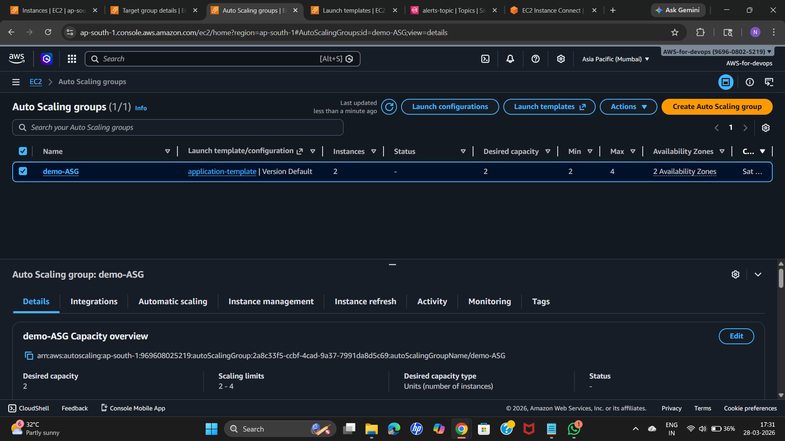

---

### 5. Configure CloudWatch Alarms

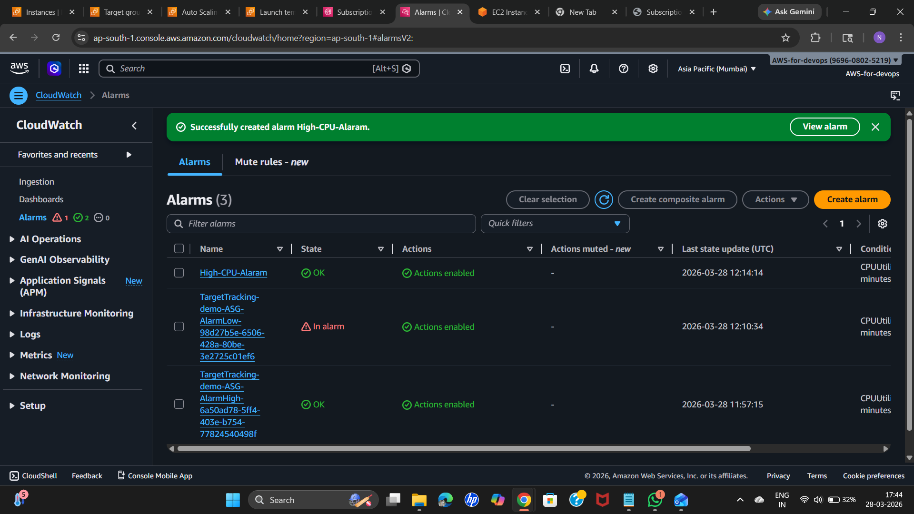

---

### 6. Configure SNS for Notifications

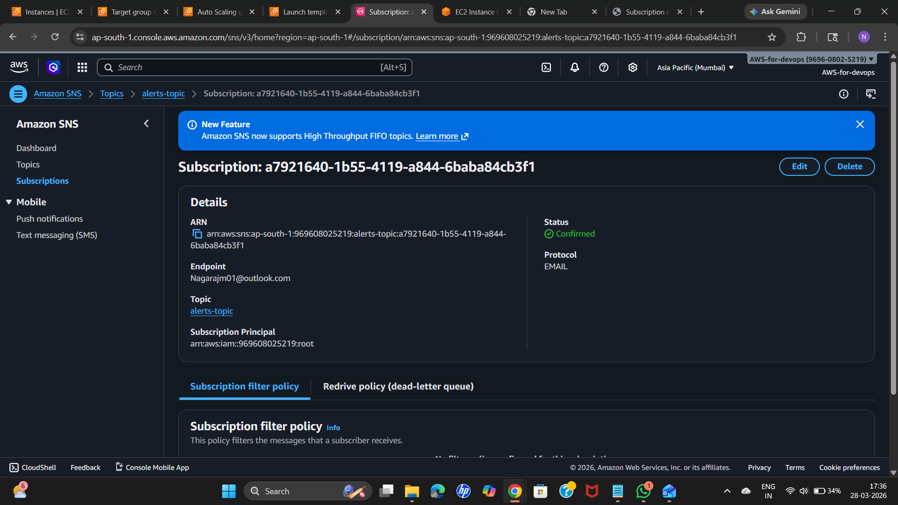  
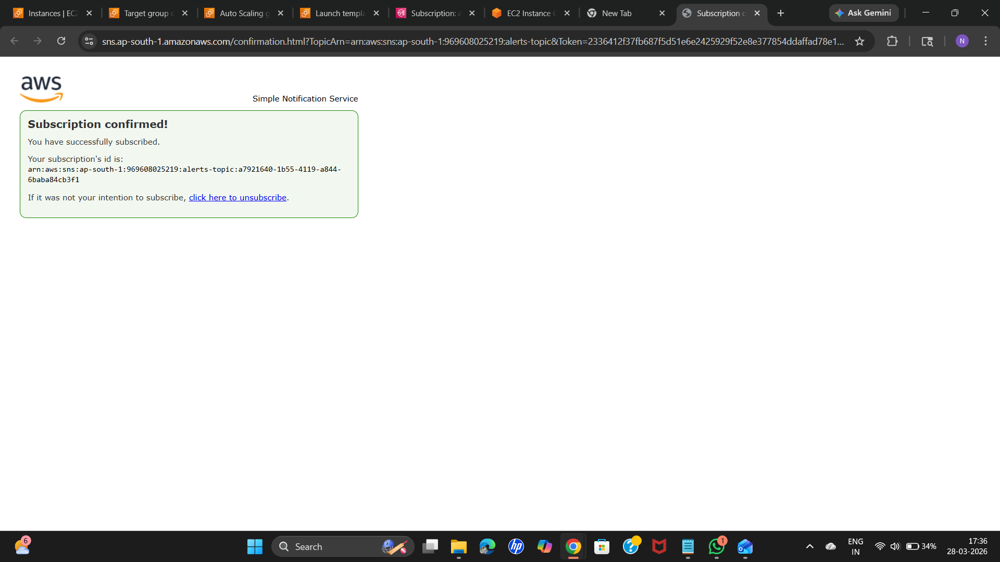

---

### 7. Testing Applications

Access your Load Balancer DNS to ensure the applications are running correctly.  

- Test path-based routing, security rules, and auto-scaling triggers.

---

## Expected Output

* EC2 instances launched in proper subnets.  
* ALB routing traffic to target groups based on path.  
* Auto Scaling Group scaling instances as per CloudWatch alarms.  
* Notifications received via SNS on threshold triggers.

---

